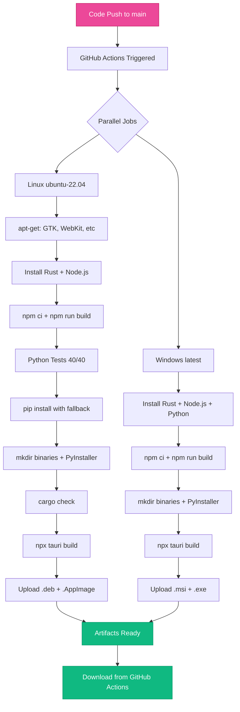
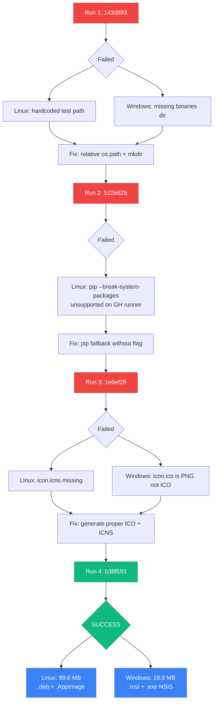

# MediaForge Session 7b — CI/CD Automation Task Log
**Date:** 2026-02-21
**Objective:** Automate the build process so Preston never has to manually install deps or compile.

---

## What Was Done

### 1. GitHub Actions CI/CD Workflow
Created `.github/workflows/build.yml` with two parallel jobs:

**Linux (ubuntu-22.04):**
- Installs GTK3, WebKit2GTK, libsoup3, librsvg2, appindicator dev packages
- Installs Rust via dtolnay/rust-toolchain (with caching)
- Installs Node.js 20 (with npm cache)
- Runs Python sidecar tests (40/40)
- Installs Python deps (pip fallback for --break-system-packages compat)
- Builds sidecar binary via PyInstaller
- Runs cargo check
- Builds Tauri app → produces .deb + .AppImage
- Uploads artifacts for download

**Windows (windows-latest):**
- Installs Rust via dtolnay/rust-toolchain (with caching)
- Installs Node.js 20 + Python 3.11
- Builds sidecar binary via PyInstaller (.exe)
- Builds Tauri app → produces .msi + .exe (NSIS)
- Uploads artifacts for download

**Triggers:** push to main, PRs to main, manual dispatch from GitHub UI

### 2. Local Build Scripts
**Windows:** `scripts/setup-windows.ps1`
- One-command build: `powershell -ExecutionPolicy Bypass -File scripts/setup-windows.ps1`
- Checks prerequisites (Node, Python), installs Rust if missing
- Creates binaries directory, installs deps, builds sidecar, builds frontend, builds Tauri app
- Outputs installer location

**Linux:** `scripts/setup-linux.sh`
- One-command build: `bash scripts/setup-linux.sh`
- Installs all system deps via apt-get
- Same pipeline: deps → tests → sidecar → frontend → Tauri

### 3. CI/CD Debugging & Fixes (4 iterations)
**Run 1 (143d893) — FAILED:**
- Linux: `ModuleNotFoundError: No module named 'core'` — test file had hardcoded absolute path
- Windows: `The system cannot find the path specified.` — `src-tauri/binaries/` directory missing (gitignored)

**Run 2 (522e62b) — FAILED:**
- Linux: Tests now pass (path fix worked) but `pip install --break-system-packages` unsupported on GH Actions runner (no such option)
- Windows: Sidecar build now passes (mkdir fix worked) but Tauri app build still running

**Run 3 (1e6ef28) — FAILED:**
- Linux: pip install works (fallback without flag), cargo check passes, but `icon.icns` missing for Tauri bundler
- Windows: `icon.ico` is PNG renamed to .ico — Windows RC compiler requires actual ICO format

**Run 4 (b38f593) — SUCCESS ✅:**
- Generated proper `icon.ico` (Windows ICO, 7 sizes) and `icon.icns` (macOS ICNS, 4 sizes)
- Both Linux and Windows builds complete — all steps green
- Artifacts uploaded: Linux 89.6 MB, Windows 18.8 MB

### 4. Supporting Files
- `sidecar/__init__.py` — Needed for PyInstaller to find modules
- `.gitignore` — Added PyInstaller build/dist/spec artifacts
- `icon.ico` — Proper Windows ICO format (7 sizes: 16-256px)
- `icon.icns` — Proper macOS ICNS format (4 sizes: 128-1024px)

---

## Files Created

| File | Purpose |
|------|---------|
| `.github/workflows/build.yml` | GitHub Actions CI/CD (Linux + Windows) |
| `scripts/setup-windows.ps1` | One-command Windows build |
| `scripts/setup-linux.sh` | One-command Linux build |
| `sidecar/__init__.py` | PyInstaller module marker |
| `src-tauri/icons/icon.icns` | Proper macOS ICNS icon (4 sizes) |

## Files Modified

| File | Change |
|------|--------|
| `.gitignore` | Added PyInstaller artifacts |
| `tests/test_sidecar.py` | Replaced hardcoded paths with relative os.path logic |
| `src-tauri/icons/icon.ico` | Regenerated as proper Windows ICO (was PNG renamed) |
| `scripts/setup-linux.sh` | Added mkdir for binaries directory |
| `scripts/setup-windows.ps1` | Added New-Item for binaries directory |

---

## Decisions Made

1. **GitHub Actions vs local-only build**
   - Chose: GitHub Actions CI/CD + local scripts
   - Alt: Local scripts only (requires user to install Rust, system deps) && Docker build (adds Docker dependency) && Pre-built binaries in repo (bloats repo)
   - Reasoning: GH Actions gives zero-install automated builds on every push; local scripts for dev iteration

2. **PyInstaller vs shipping Python runtime**
   - Chose: PyInstaller --onefile (single binary, no Python needed at runtime)
   - Alt: Embed Python interpreter (complex, large) && Require Python install (friction) && Rewrite sidecar in Rust (scope creep)
   - Reasoning: Single binary is cleanest for end users; PyInstaller handles module bundling

3. **ubuntu-22.04 vs ubuntu-latest**
   - Chose: ubuntu-22.04 (explicit)
   - Alt: ubuntu-latest (may change underlying version) && ubuntu-24.04 (newer, less tested)
   - Reasoning: WebKit2GTK-4.1 packages are well-tested on 22.04; pinning avoids surprises

4. **pip install fallback strategy**
   - Chose: `pip install ... || pip install ... --break-system-packages`
   - Alt: Always use --break-system-packages (fails on GH Actions venv) && Use venv in workflow (adds complexity) && Pin pip version (fragile)
   - Reasoning: Try without flag first (GH Actions uses venv), fall back for system Python

5. **ICNS generation approach**
   - Chose: Python Pillow with manual ICNS binary construction
   - Alt: Use iconutil (macOS only, not available on Linux) && Use icnsutils package (not installed) && Ship pre-built .icns in repo (opaque)
   - Reasoning: ICNS format is simple (magic + PNG entries); Pillow handles resize + PNG encoding

6. **PowerShell vs cmd for Windows CI steps**
   - Chose: PowerShell (default shell, uses Copy-Item / New-Item)
   - Alt: cmd shell with copy / mkdir (failed on path resolution) && bash via Git Bash (adds dependency)
   - Reasoning: PowerShell is default on windows-latest runners; Copy-Item handles path separators better

---

## Validation Results

| Check | Result |
|-------|--------|
| Workflow YAML syntax | Valid |
| Tests on GH Actions (Linux) | 40/40 pass |
| pip install (Linux) | Succeeds with fallback |
| PyInstaller sidecar (Linux) | Builds successfully |
| Cargo check (Linux) | 0 errors, 0 warnings |
| Tauri build (Linux) | .deb + .AppImage produced |
| Linux artifacts uploaded | 89.6 MB |
| PyInstaller sidecar (Windows) | Builds .exe successfully |
| Tauri build (Windows) | .msi + .exe NSIS produced |
| Windows artifacts uploaded | 18.8 MB |
| icon.ico format | Proper Windows ICO (7 sizes) |
| icon.icns format | Proper macOS ICNS (4 sizes) |
| Local tests still pass | 40/40 |
| All 4 CI iterations documented | Yes |

---

## How to Use

### Option A: Fully Automated (Recommended)
1. Push code to `main` branch
2. Go to https://github.com/pwp6z9/mediaforge/actions
3. Wait for build to complete (~8-12 min)
4. Download artifacts (installers) from the completed run

### Option B: Manual Trigger
1. Go to https://github.com/pwp6z9/mediaforge/actions
2. Click "Build MediaForge" workflow
3. Click "Run workflow" → "Run workflow"

### Option C: Build Locally (Windows)
```powershell
git clone https://github.com/pwp6z9/mediaforge.git
cd mediaforge
powershell -ExecutionPolicy Bypass -File scripts/setup-windows.ps1
```

### Option D: Build Locally (Linux)
```bash
git clone https://github.com/pwp6z9/mediaforge.git
cd mediaforge
bash scripts/setup-linux.sh
```

---

## Logic Diagram



### Debug Iteration Flow


